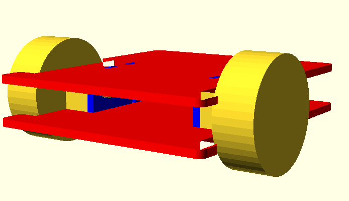
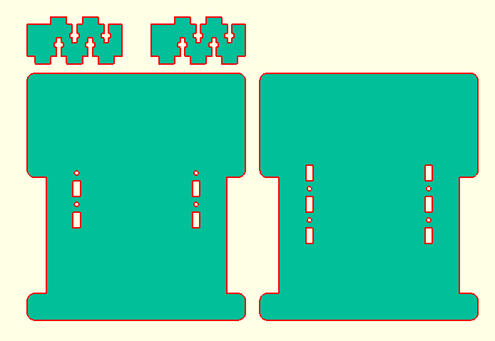

# A-Bot
Een eigen kleine programmeerbare zelf-rijdende robot maken
[http://knutselbaar.be/projecten/A-Bot](http://knutselbaar.be/projecten/A-Bot)

## Inleiding

Tijdens een bezoek aan [Technolopis](http://technopolis.be) ontdekte onze zoon Arjen, 5 jaar, de [Bee Bot](https://www.bee-bot.us). Een zeer eenvoudige, programmeerbare, zelf-rijdende robot.

Via enkele knoppen kan deze robot geprogrammeerd worden om rond te rijden: rechtdoor, rechts/links draaien,... Op die manier kunnen kinderen eenvoudig leren om via elementaire ruimtelijke instructies de robot een parcours af te laten leggen.

Je kan deze bots kopen, aan een prijs van ongeveer 80 euro, maar ... je kan dit ook vrij eenvoudig zelf maken. Er bestaan zelfs veel kits van gelijkaardige robots, maar ... je kan dit ook vrij eenvoudig zelf maken :-)

Dit project is bedoeld om te tonen hoe je dit kan doen en hoe je dus naast veel plezier met de robot zelf, ook heel veel plezier kan hebben om te leren hoe je dit zelf kan bouwen.

Er zijn verschillende aspecten aan: enerzijds de constructie van de robot en anderzijds de programmatie om hem echt tot leven te brengen.

### In deze _repository_

...verzamelen we alle bestanden, documenten, tekeningen, ontwerpen die we maken om de E-Liner te ontwerpen, alsook de software die we er op zetten om hem te laten rijden en te programmeren.

## Design

## Onderdelen

* 1 x [Gravity Keypad](https://iprototype.nl/products/components/buttons-switches/gravity-keypad) (~&euro;8)
* 1 x set [DC motoren en wielen](https://iprototype.nl/products/robotics/servo-motors/motors-wheels) (~&euro;18)
* 1 x [Ball caster](https://iprototype.nl/products/robotics/misc/ball-caster-30mm) (~&euro;2,30)
* 1 x set [Encoders voor DC motor](https://iprototype.nl/products/robotics/misc/dc-motor-encoder) (~&euro;15,50)
* 1 x [Batterijbox 4xAA](https://iprototype.nl/products/accessoires/power/battery-box-4xAA) (~&euro;4,75)

Wordt vervolgd...
