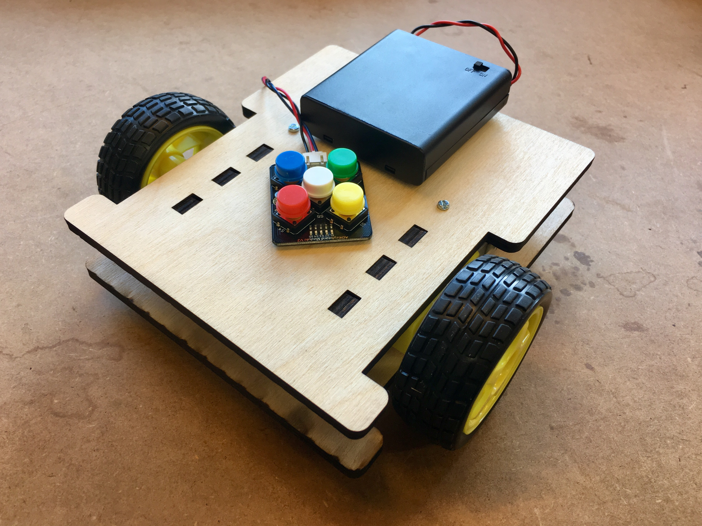
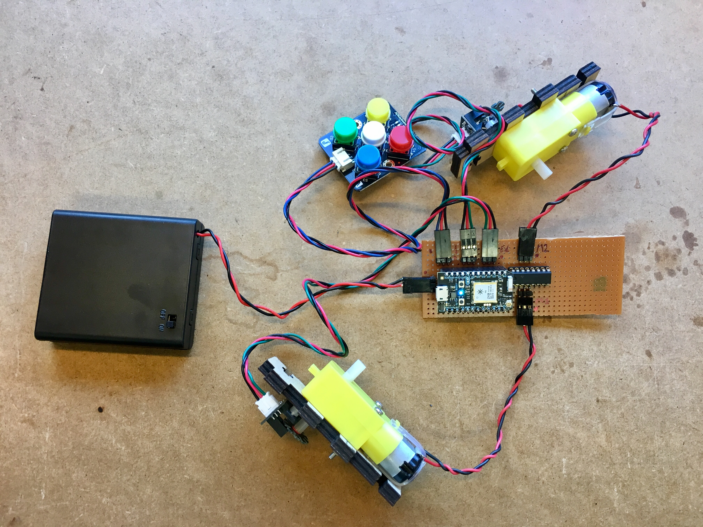
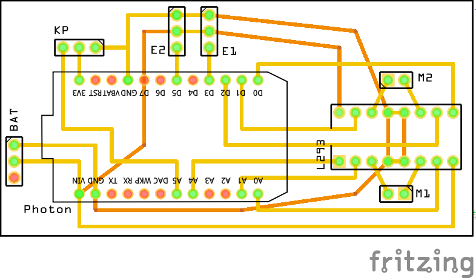

# A-Bot

Deze applicatie brengt alle onderdelen van de A-Bot samen tot een programmeerbaar robotje.



## Wat moet je bouwen?

Als we nu 2 [motoren](../motor/), 2 [encoders](../encoder/) en 1 [keypad](../keypad/) samenbrengen en zelf eventueel een _gaatjesprint_ maken, bekom je de volledige electronica die je nodig hebt:





Als je andere pinnen van de Photon gebruikt, kan je dit in [`config.h`](config.h) configureren.

## Hoe doe je dit werken op de Photon?

Vanuit de `src/` folder, geef je het commando `make`:

```bash
$ PROJECT=a-bot make
*** Compileren en flashen van a-bot
particle flash 2b002f001147333439313830 a-bot
Including:
    a-bot/config.h
    a-bot/a-bot.ino
attempting to flash firmware to your device 2b002f001147333439313830
Flash device OK:  Update started
*** Start van console uitvoer. Beëindig met 'Ctrl+a k y'.
    Druk op een toets om verder te gaan...
```
