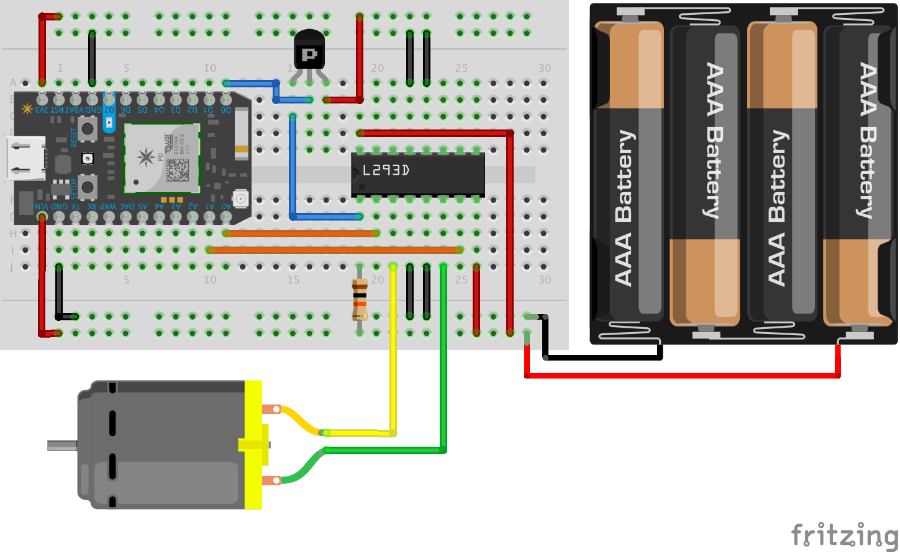

# Motor

Dit is de basis opstelling voor het aansturen van een motor.

## Wat moet je bouwen?



_uitleg volgt weldra ;-)_

## Hoe werkt dit?


_uitleg volgt weldra ;-)_

## Hoe doe je dit werken op de Photon?

Vanuit de `src/` folder, geef je het commando `make`:

```bash
$ PROJECT=motor make
*** Compileren en flashen van motor
particle flash 370026000447333436363331 motor
Including:
    /Users/xtof/Workspace/knutselbaar/a-bot/src/motor/motor.ino
attempting to flash firmware to your device 370026000447333436363331
Flash device OK:  Update started
*** Start van console uitvoer. Beëindig met 'Ctrl+a k y'.
    Druk op een toets om verder te gaan...
```

```
60
80
100
120
140
160
180
200
220
240
260
280
-60
-80
-100
-120
-140
-160
-180
-200
-220
-240
-260
-280
```

_uitleg volgt weldra ;-)_

